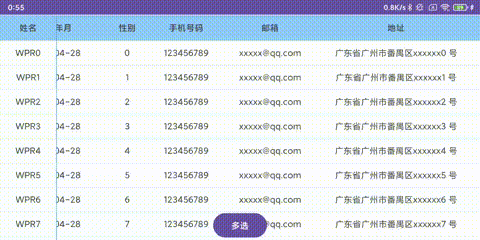

# RPWDataGridView

#### 介绍
一个超级简洁的表格控件，支持固定多列，目前支持基本数据加载，点击事件

#### 使用说明

自行打包依赖

1. `RPWDataGridView<T>` 表格控件 T为数据类型
1. 主要接口
 + `build(...)` 添加列
 + `setRowBuildListener`  行数据构建接口，在这设置每列显示的数据
 + `setDataSource` 设置数据源

#### 参与贡献

1.  Fork 本仓库
2.  新建 Feat_xxx 分支
3.  提交代码
4.  新建 Pull Request

